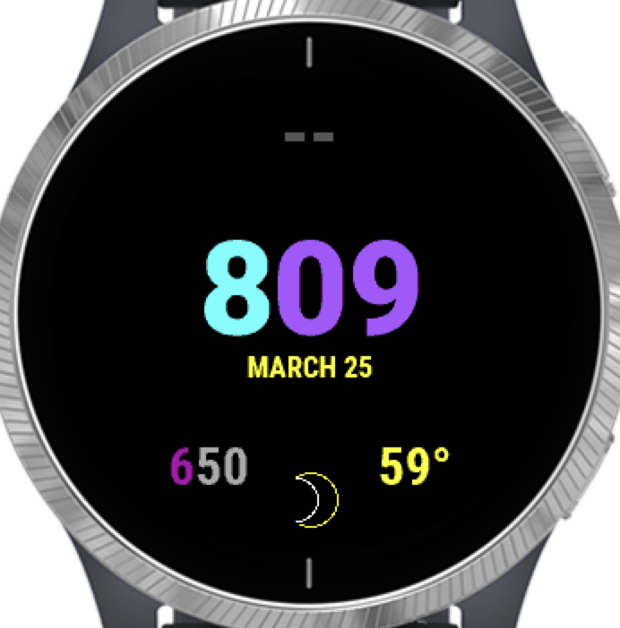

# Watch Face

A simple watch face for the Garmin Vivoactive 4.

## Fields

- Heart Rate (**top**)
- Time (**center**)
- Month and Date (**center**)
- Sunset/Sunrise (**bottom left**)
- Weather Condition (**bottom center**)
- Temperature (**bottom right**)

## Notes

- The outside fields are positioned based off of a circle circumference.
- The HR color is based off HR ranges. It will be green, yellow, or red depending on how high your HR is.
- Sunrise will show if it's before sunrise If it's past sunrise, sunset will show. If it's after sunset, the sunrise for the next day will show.
- Currently, there are sun, rain, cloud, snow, and wind weather icons. In the future, additional icons could be created for other conditions, e.g., partially cloudy.

## Information

- Download size: **17.12 KB**

## Contributing Information

- The main view is defined in `View.mc`. All functionality is defined in separate files and then implemented either directly or indirectly in the `onUpdate` method of the `watch_faceView` class.
- Run the development emulator by running the Monkey C Debugger (CTRL + F5 in VSCode)
- To build a release file run **Monkey C: Export Project** (CMD + Shift + P in VSCode)
  - Upload the `*.iq` file in the Garmin Connect IQ developer dashboard
    - New versions should follow semantic versioning (major.minor.patch)

## Resources

- [Monkey C Docs](https://developer.garmin.com/connect-iq/monkey-c/)
- [Toybox Library Docs](https://developer.garmin.com/connect-iq/api-docs/index.html)
